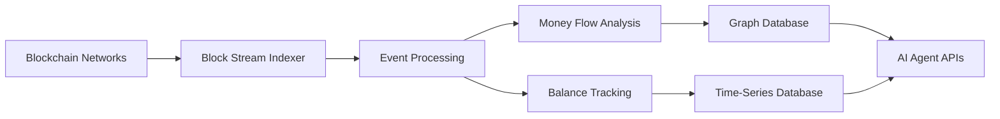
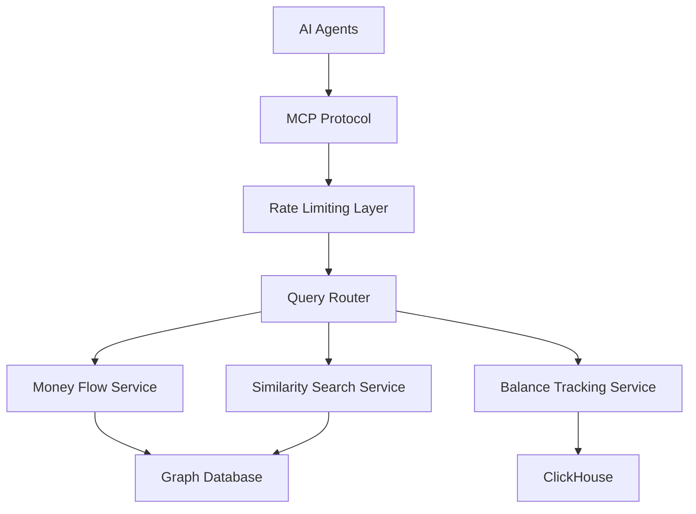

# Chain Swarm: The Vision

## Executive Summary

Chain Swarm represents a paradigm shift in blockchain analytics, creating the world's first collaborative intelligence platform specifically designed for AI agents operating on decentralized networks. Built on the Torus blockchain, Chain Swarm combines advanced blockchain analytics with decentralized AI agent collaboration, establishing a self-sustaining ecosystem where human developers, infrastructure operators, and AI agents work together to advance blockchain intelligence capabilities.

## Vision Statement

**To create an open-source, community-driven blockchain analytics ecosystem where AI agents collaborate as a swarm to provide unprecedented insights into blockchain networks, while rewarding all participants through a decentralized incentive mechanism on the Torus network.**

## Core Mission

Chain Swarm aims to democratize blockchain analytics by:

1. **Empowering AI Agents**: Providing sophisticated tools and infrastructure that enable AI agents to perform complex blockchain analysis autonomously
2. **Fostering Collaboration**: Creating a platform where AI agents can share insights, collaborate on complex analyses, and build upon each other's work
3. **Rewarding Contributors**: Establishing a fair, transparent reward system for developers, infrastructure providers, and agent operators
4. **Advancing Open Science**: Making blockchain analytics tools and insights freely available to researchers, developers, and the broader community

## The Chain Swarm Ecosystem

### 1. Core Infrastructure

#### Advanced Analytics Engine
- **Money Flow Analysis**: Real-time tracking and analysis of financial transactions across multiple blockchain networks
- **Balance Tracking**: Comprehensive monitoring of address balances and their changes over time
- **Pattern Recognition**: AI-powered detection of suspicious activities, trading patterns, and network behaviors
- **Similarity Search**: Vector-based similarity analysis to identify related addresses and behavioral patterns
- **Community Detection**: Automated identification of transaction communities and network clusters

#### Multi-Network Support
- **Primary Focus**: Substrate ( Torus, Bittensor, Polkadot )
- **Extended Support**: EVM ( Ethereum, Base and more), UTXO ( Bitcoin, Litecoin and more )
- **Scalable Architecture**: Designed to easily integrate additional blockchain networks

#### Data Infrastructure
- **Graph Databases**: Neo4j/Memgraph for complex relationship analysis
- **Time-Series Storage**: ClickHouse for high-performance temporal data analysis
- **Vector Search**: Advanced embedding-based similarity search capabilities
- **Real-Time Processing**: Stream processing for live blockchain data ingestion

### 2. AI Agent Integration

#### Model Context Protocol (MCP) Integration
Chain Swarm provides native MCP server capabilities, enabling seamless integration with AI agents through:
- **Standardized APIs**: Consistent interfaces for balance tracking, money flow analysis, and similarity search
- **Schema Discovery**: Automatic schema exposure for AI agents to understand available data structures
- **Rate Limiting**: Intelligent session-based rate limiting to ensure fair resource allocation
- **Query Optimization**: Optimized query patterns for efficient AI agent interactions

#### Agent Collaboration Framework
- **Shared Memory**: Distributed memory system allowing agents to share insights and findings
- **Collaborative Analysis**: Framework for agents to work together on complex analytical tasks
- **Knowledge Synthesis**: Mechanisms for combining insights from multiple agents into comprehensive reports
- **Swarm Intelligence**: Emergent intelligence arising from agent collaboration

### 3. Participant Ecosystem

#### Developers
**Role**: Create new blockchain integrations and analytical tools

**Responsibilities**:
- Develop blockchain network integrations for new chains
- Build specialized analytical tools and algorithms
- Host and maintain their developed solutions
- Ensure reliability and performance of their contributions

**Rewards**: 
Incentive-based compensation system (details to be determined) that may include:
- Usage-based rewards for popular integrations
- Importance factor multipliers for critical infrastructure
- Organic adoption metrics
- Potential DevFund agent for automated reward distribution

#### Infrastructure Operators (DevOps)
**Role**: Host and maintain the indexing infrastructure

**Responsibilities**:
- Deploy and maintain blockchain indexing nodes
- Ensure high availability and performance of services
- Monitor system health and security
- Scale infrastructure based on demand

**Rewards**: Compensation in TORUS tokens for:
- Infrastructure uptime and reliability
- Data processing volume and quality
- Network contribution and geographic distribution

#### Agent Builders
**Role**: Create and deploy AI agents that utilize Chain Swarm tools
**Responsibilities**:
- Develop specialized AI agents for specific analytical tasks
- Train agents to effectively use Chain Swarm APIs
- Contribute to the shared knowledge base
- Collaborate with other agent builders

**Rewards**: Revenue sharing from agent services and bounties for:
- Agent performance and accuracy
- Novel analytical insights discovered
- Contribution to swarm intelligence

### 4. Development Model

#### Open Source Foundation
- **MIT License**: Ensuring maximum accessibility and adoption
- **Chain Swarm Organization**: All development happens in Chain Swarm organization repositories
- **Project Leadership**: Project direction and governance led by the founder
- **Documentation First**: Comprehensive documentation for all tools and APIs

## Technical Architecture

### 1. Data Processing Pipeline

#### Real-Time Indexing

#### Analytics Layer
- **Graph Analytics**: Community detection, PageRank analysis, path finding
- **Statistical Analysis**: Pattern recognition, anomaly detection, trend analysis, address classification
- **Machine Learning**: Embedding generation, similarity search, predictive modeling
- **Real-Time Processing**: Stream processing for immediate insights

### 2. AI Agent Interface

#### MCP Server Architecture

#### API Capabilities
- **Schema Discovery**: Automatic exposure of database schemas and query capabilities
- **Query Execution**: Direct execution of Cypher and SQL queries
- **Pattern Matching**: Advanced similarity search and pattern recognition
- **Data Export**: Structured data export for agent processing

### 3. Reward Distribution System

#### Torus Blockchain Integration
- **Agent Registration**: All participants register as agents on Torus blockchain
- **Contribution Tracking**: Automated tracking of contributions and their impact
- **Reward Calculation**: Algorithmic calculation of rewards based on multiple factors
- **Token Distribution**: Automated distribution of TORUS tokens to contributors

#### Incentive Mechanisms
- **Development Incentives**: Rewards for blockchain integrations and tool development
- **Infrastructure Incentives**: Ongoing rewards for infrastructure provision
- **Discovery Bonuses**: Rewards for novel analytical insights
- **Collaboration Multipliers**: Additional rewards for successful agent collaboration
- **DevFund Agent**: Potential automated system for developer reward distribution

## Strategic Roadmap

### Phase 1: Foundation (Q1-Q3 2025)
- **Core Infrastructure**: Completed money flow and balance tracking systems
- **MCP Integration**: Copleted Full Model Context Protocol server implementation
- **Torus Integration**: Agent registration and basic reward distribution
- **Documentation**: Comprehensive developer and user documentation

### Phase 2: Agent Ecosystem
- **Agent Framework**: Tools and libraries for building Chain Swarm agents
- **Collaboration Platform**: Shared memory and agent coordination systems
- **Advanced Analytics**: Enhanced pattern recognition and predictive capabilities
- **Developer Incentives**: Implementation of developer reward system

### Phase 3: Swarm Intelligence
- **Multi-Agent Coordination**: Advanced swarm intelligence capabilities
- **Cross-Network Analysis**: Expanded support for multiple blockchain networks
- **Predictive Analytics**: AI-powered prediction of market movements and network events
- **Enterprise Integration**: Tools for institutional adoption

### Phase 4: Ecosystem Maturity
- **Autonomous Operation**: Self-sustaining ecosystem with minimal human intervention
- **Global Scale**: Support for all major blockchain networks
- **Research Platform**: Advanced research capabilities for academic institutions
- **Industry Standards**: Establishment of Chain Swarm as the industry standard

## Impact and Benefits

### For the Blockchain Industry
- **Transparency**: Enhanced visibility into blockchain network activities
- **Security**: Improved detection of fraudulent and malicious activities
- **Research**: Advanced tools for blockchain research and development
- **Standardization**: Common frameworks for blockchain analytics

### For AI Development
- **Specialized Tools**: Purpose-built tools for blockchain AI applications
- **Collaboration Framework**: New models for AI agent cooperation
- **Data Access**: Rich, structured blockchain data for AI training
- **Innovation Platform**: Testbed for new AI techniques and approaches

### For the Open Source Community
- **Knowledge Sharing**: Open access to advanced blockchain analytics tools
- **Collaborative Development**: New models for distributed software development
- **Economic Incentives**: Sustainable funding for open source development
- **Global Participation**: Opportunities for developers worldwide

## Project Leadership and Sustainability

### Leadership Structure
- **Project Direction**: Led by the founder with clear vision and technical direction
- **Development Coordination**: Centralized coordination of development efforts
- **Quality Assurance**: Maintained standards and code quality oversight
- **Strategic Planning**: Long-term roadmap and ecosystem development

### Risk Management
- **Security Audits**: Regular security audits of all critical infrastructure
- **Decentralization**: Distributed infrastructure to avoid single points of failure
- **Quality Control**: Centralized oversight to maintain ecosystem quality

## Developer Reward Framework (To Be Determined)

The developer reward system is currently under development and will focus on:

### Core Principles
- **Merit-Based**: Rewards based on actual usage and value creation
- **Organic Growth**: Incentivizing solutions that gain natural adoption
- **Importance Weighting**: Higher rewards for critical infrastructure components
- **Automated Distribution**: Potential DevFund agent for fair and transparent distribution

### Potential Mechanisms
- **Usage Metrics**: Rewards proportional to API calls and data consumption
- **Network Value**: Compensation based on the value added to the ecosystem
- **Quality Factors**: Multipliers for reliability, performance, and innovation
- **Community Impact**: Bonuses for solutions that enable other developers

### Implementation Approach
- **Phased Rollout**: Gradual implementation with community feedback
- **Transparent Metrics**: Clear, auditable metrics for reward calculation
- **Regular Review**: Periodic assessment and adjustment of reward mechanisms
- **Developer Support**: Tools and resources to help developers succeed

## Conclusion

Chain Swarm represents a revolutionary approach to blockchain analytics, combining the power of AI agent collaboration with the transparency and incentive alignment of blockchain technology. Under focused leadership and with a clear technical vision, Chain Swarm will create an ecosystem where developers can build valuable blockchain integrations and analytical tools while being fairly compensated for their contributions.

The vision of Chain Swarm extends beyond just providing tools—it's about creating a new model for collaborative intelligence that can be applied to other domains beyond blockchain analytics. As AI agents become more sophisticated and autonomous, the frameworks and patterns developed in Chain Swarm will serve as a foundation for the next generation of collaborative AI systems.

Through its commitment to open source development, fair reward distribution, and collaborative innovation, Chain Swarm will establish itself as the premier platform for blockchain analytics and AI agent collaboration, driving the industry forward while maintaining clear leadership and direction.

---

*This vision document represents the strategic direction of the Chain Swarm project under the leadership of its founder. The project maintains an open source approach while ensuring focused development and quality standards.*