# ChainSwarm

**AI-Powered Blockchain Intelligence Platform**

ChainSwarm is a sophisticated blockchain data indexing and analysis platform designed for AI integration through the Model Context Protocol (MCP). It provides real-time insights, advanced analytics, and intelligent data access for Substrate-based blockchain networks.

## 🎯 Overview

ChainSwarm transforms raw blockchain data into actionable intelligence through:
- **Real-time data indexing** from Substrate networks
- **AI-native architecture** with MCP server integration
- **Multi-dimensional analytics** including balance tracking, money flow analysis, and similarity search
- **Scalable infrastructure** supporting multiple blockchain networks

### Key Value Propositions
- **For AI Developers**: Native MCP integration enables seamless blockchain data access in AI applications
- **For Analysts**: Advanced query capabilities with time-series and graph databases
- **For Researchers**: Vector-based similarity search for pattern discovery
- **For Enterprises**: Scalable, production-ready infrastructure with comprehensive monitoring

## 🏗️ High-Level Architecture

```mermaid
graph TB
    subgraph "Blockchain Networks"
        TR[🟢 Torus Network<br/>Production Ready]
        BT[🔄 Bittensor Network<br/>Coming Soon]
        PD[🔄 Polkadot Network<br/>Coming Soon]
    end
    
    subgraph "ChainSwarm Platform"
        subgraph "🤖 AI Integration Layer"
            MCP[MCP Server<br/>Model Context Protocol]
            TOOLS[AI Tools & Resources]
        end
        
        subgraph "📊 Data Processing Pipeline"
            BI[Block Stream Indexer]
            BTI[Balance Tracking Indexer]
            MFI[Money Flow Indexer]
            SSI[Similarity Search Indexer]
        end
        
        subgraph "💾 Multi-Modal Storage"
            CH[(ClickHouse<br/>Time-Series Data)]
            MG[(Memgraph<br/>Graph Analytics)]
            N4[(Neo4j<br/>Graph Queries)]
        end
        
        subgraph "🌐 API Layer"
            REST[REST API<br/>FastAPI]
            RL[Rate Limiting<br/>Session Management]
        end
    end
    
    subgraph "🔌 Client Integration"
        AI[AI Applications<br/>LLMs, Agents]
        WEB[Web Dashboards]
        CLI[CLI Tools]
        SDK[Custom Applications]
    end
    
    TR --> BI
    BT -.-> BI
    PD -.-> BI
    
    BI --> BTI
    BI --> MFI
    BI --> SSI
    
    BTI --> CH
    MFI --> MG
    MFI --> N4
    SSI --> MG
    
    CH --> REST
    MG --> REST
    N4 --> REST
    
    REST --> RL
    RL --> MCP
    MCP --> TOOLS
    
    TOOLS --> AI
    REST --> WEB
    REST --> CLI
    REST --> SDK
```



## 🤖 AI-First Design

### Model Context Protocol (MCP) Integration

ChainSwarm is built with AI-first principles, providing native integration through the Model Context Protocol:


### AI-Powered Analytics Tools

| Tool Category | MCP Tools | Capabilities |
|---------------|-----------|--------------|
| **Balance Intelligence** | `balance_query`, `balance_schemas` | Historical balance analysis, portfolio tracking, asset flow monitoring |
| **Money Flow Analysis** | `money_flow_query`, `money_flow_schema` | Transaction pattern recognition, fund movement visualization, network analysis |
| **Similarity Search** | `similarity_search_query`, `similarity_search_schema` | Vector-based address clustering, behavioral pattern matching, anomaly detection |
| **Network Intelligence** | `networks`, `session_stats` | Multi-network support, usage analytics, performance monitoring |

## 🔧 Technical Architecture

### Data Processing Pipeline


### Multi-Modal Data Storage


## 🌐 Network Support

### Current Status

| Network | Status | Native Asset | MCP Tools Available | Infrastructure |
|---------|--------|--------------|-------------------|----------------|
| **Torus** | 🟢 **Production** | TOR | ✅ All Features | Full deployment |
| **Bittensor** | 🔄 **Development** | TAO | 🚧 Coming Soon | Infrastructure ready |
| **Polkadot** | 🔄 **Planned** | DOT | 🚧 Coming Soon | Infrastructure ready |

### Torus Network Features

Currently supporting the Torus network with full feature set:

- **Balance Tracking**: Real-time TOR balance monitoring across all accounts
- **Money Flow Analysis**: Transaction pattern analysis and fund movement visualization  
- **Similarity Search**: AI-powered address clustering and behavioral analysis
- **Known Addresses**: Entity identification and labeling system
- **Multi-Asset Support**: Native TOR asset tracking with extensible framework

## 🛠️ Technology Stack

### Core Technologies
- **Backend Framework**: Python 3.11+, FastAPI
- **AI Integration**: Model Context Protocol (MCP), FastMCP
- **Blockchain Interface**: Substrate Interface, WebSocket connections
- **Databases**: 
  - ClickHouse (time-series analytics)
  - Memgraph (real-time graph processing)
  - Neo4j (graph query optimization)

### Infrastructure & DevOps
- **Containerization**: Docker, Docker Compose
- **Monitoring**: Dozzle (log aggregation), Portainer (container management)
- **Database UIs**: ClickHouse UI, Memgraph Lab
- **Load Balancing**: Nginx (for multi-node deployments)

### AI & Analytics
- **Vector Search**: Memgraph vector extensions
- **Pattern Recognition**: Custom similarity algorithms
- **Rate Limiting**: Session-based and global rate limiting
- **Data Processing**: Event-driven architecture with specialized indexers

## 🚀 Getting Started

### Quick Start with MCP

1. **Prerequisites**: Docker and Docker Compose installed
2. **Environment Setup**: Copy `.env.example` to `.env` and configure
3. **Infrastructure Deployment**: See `docs/deployment/` for detailed instructions
4. **MCP Server Access**: Connect to `http://localhost:8005` for MCP integration

### MCP Integration Example

```python
# Example: Using ChainSwarm MCP tools in an AI application
from mcp_client import MCPClient

client = MCPClient("http://localhost:8005")

# Get balance data for AI analysis
balance_data = await client.call_tool("balance_query", {
    "network": "torus",
    "query": "SELECT * FROM balance_changes WHERE amount > 1000000",
    "assets": ["TOR"]
})

# Analyze money flow patterns
flow_analysis = await client.call_tool("money_flow_query", {
    "network": "torus", 
    "query": "MATCH (a:Address)-[t:TRANSFER]->(b:Address) WHERE t.amount > 1000000 RETURN a, t, b",
    "assets": ["TOR"]
})
```

## 📊 Use Cases & Applications

### For AI Developers
- **Blockchain-aware LLMs**: Integrate real-time blockchain data into language models
- **Trading Bots**: Access balance and flow data for algorithmic trading
- **Risk Analysis**: Use similarity search for fraud detection and compliance

### For Data Scientists
- **Pattern Discovery**: Vector-based similarity search for behavioral analysis
- **Network Analysis**: Graph-based transaction flow visualization
- **Time-Series Analysis**: Historical balance and volume trend analysis

### For Enterprises
- **Compliance Monitoring**: Track large transactions and suspicious patterns
- **Portfolio Management**: Multi-asset balance tracking and reporting
- **Research & Analytics**: Custom queries across time-series and graph data

## 🔗 API Reference

### REST API Endpoints
- **Health Check**: `GET /health`
- **Networks**: `GET /networks`
- **Balance Tracking**: `/balance/*`
- **Money Flow**: `/money-flow/*`
- **Similarity Search**: `/similarity/*`
- **Known Addresses**: `/known-addresses/*`

### MCP Tools
- **Network Tools**: `networks`, `session_stats`
- **Balance Tools**: `balance_schemas`, `balance_query`
- **Money Flow Tools**: `money_flow_schema`, `money_flow_query`
- **Similarity Tools**: `similarity_search_schema`, `similarity_search_query`

## 📚 Documentation

- **Deployment Guide**: `docs/deployment/`
- **API Documentation**: `docs/api/`
- **MCP Integration**: `docs/mcp/`
- **Development Setup**: `docs/development/`
- **Architecture Deep Dive**: `docs/architecture/`

## 🤝 Contributing

We welcome contributions! Please see our contributing guidelines in `docs/contributing/` for:
- Development environment setup
- Code style and standards
- Testing requirements
- Pull request process

## 📄 License

This project is licensed under the MIT License - see the LICENSE file for details.

## 🔮 Roadmap

### Q1 2025
- ✅ Torus network full integration
- 🔄 Bittensor network implementation
- 🔄 Enhanced MCP tool capabilities

### Q2 2025
- 🔄 Polkadot network integration
- 🔄 Advanced AI analytics features
- 🔄 Multi-network cross-analysis tools

### Q3 2025
- 🔄 Additional Substrate network support
- 🔄 Real-time alerting system
- 🔄 Advanced visualization tools

---

**ChainSwarm** - Transforming blockchain data into AI-powered insights