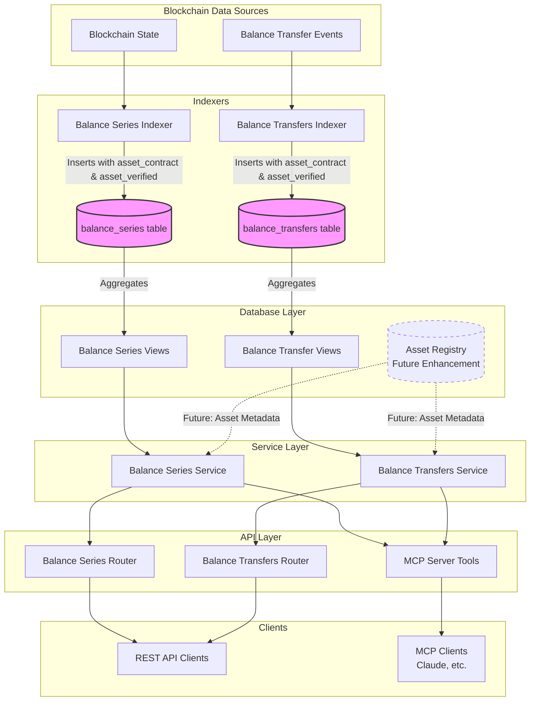

# Asset Contract Data Flow Diagram



## Data Flow Description

### 1. Data Ingestion
- **Blockchain State**: Provides balance snapshots at regular intervals
- **Balance Transfer Events**: Provides transfer transaction data
- Both sources now include asset information that needs contract and verification status

### 2. Indexing Layer
- **Balance Series Indexer**: 
  - Reads blockchain state
  - Determines `asset_contract` (empty for native assets)
  - Sets `asset_verified` (verified for TOR/TAO/DOT, unknown for others)
  - Inserts into `balance_series` table

- **Balance Transfers Indexer**:
  - Processes transfer events
  - Applies same asset_contract and asset_verified logic
  - Inserts into `balance_transfers` table

### 3. Database Layer
- **Tables**: Store raw data with new fields
- **Views**: Aggregate data while preserving asset_contract and asset_verified
- **Future Asset Registry**: Centralized asset metadata management

### 4. Service Layer
- Queries include new fields in all SELECT statements
- Returns enriched data with verification status
- Future: Can join with Asset Registry for additional metadata

### 5. API Layer
- REST API endpoints automatically include new fields
- MCP tools expose asset verification in schema
- No breaking changes to existing API contracts

## Key Implementation Points

### Asset Verification Logic

```python
def get_asset_verification(network: str, asset: str, contract: str = '') -> tuple[str, str]:
    """
    Determine asset_contract and asset_verified values
    
    Returns:
        tuple of (asset_contract, asset_verified)
    """
    # Native assets mapping
    NATIVE_ASSETS = {
        'torus': 'TOR',
        'bittensor': 'TAO',
        'polkadot': 'DOT'
    }
    
    # Check if it's a native asset
    if network in NATIVE_ASSETS and asset == NATIVE_ASSETS[network]:
        return '', 'verified'
    
    # For non-native assets
    # Future: Check against known malicious contracts
    # Future: Check against verified contracts list
    
    return contract, 'unknown'
```

### Query Example with New Fields

```sql
-- Example: Get current balances with verification status
SELECT 
    address,
    asset,
    asset_contract,
    asset_verified,
    total_balance,
    CASE 
        WHEN asset_verified = 'malicious' THEN 'WARNING: Potentially malicious asset'
        WHEN asset_verified = 'unknown' THEN 'Unverified asset - proceed with caution'
        ELSE 'Verified asset'
    END as verification_message
FROM balance_series_latest_view
WHERE address = '5C4n8kb3mno7i8vQmqNgsQbwZozHvPyou8TAfZfZ7msTkS5f'
ORDER BY total_balance DESC;
```

### API Response Example

```json
{
  "items": [
    {
      "address": "5C4n8kb3mno7i8vQmqNgsQbwZozHvPyou8TAfZfZ7msTkS5f",
      "asset": "TOR",
      "asset_contract": "",
      "asset_verified": "verified",
      "free_balance": "1000000",
      "reserved_balance": "0",
      "staked_balance": "500000",
      "total_balance": "1500000"
    },
    {
      "address": "5C4n8kb3mno7i8vQmqNgsQbwZozHvPyou8TAfZfZ7msTkS5f",
      "asset": "SCAM_TOKEN",
      "asset_contract": "5Xyz...contract_address",
      "asset_verified": "malicious",
      "free_balance": "999999999",
      "reserved_balance": "0",
      "staked_balance": "0",
      "total_balance": "999999999"
    }
  ],
  "pagination": {
    "page": 1,
    "page_size": 20,
    "total_items": 2,
    "total_pages": 1
  }
}
```

## Benefits of This Implementation

1. **Security**: Users can immediately identify potentially malicious assets
2. **Transparency**: Asset ownership/creation is visible through asset_contract
3. **Flexibility**: Verification status can be updated without schema changes
4. **Performance**: No additional joins needed for basic queries
5. **Extensibility**: Future asset registry can enhance functionality

## Future Enhancements

1. **Automated Verification**:
   - Monitor new assets appearing in the system
   - Check against known scam patterns
   - Community reporting system

2. **Asset Registry Integration**:
   - Centralized asset metadata
   - Historical verification changes
   - Additional asset properties (logo, website, etc.)

3. **API Filtering**:
   - Filter by verification status
   - Exclude malicious assets by default
   - Warning system for unknown assets

4. **Admin Interface**:
   - Update asset verification status
   - Manage asset registry
   - View verification history