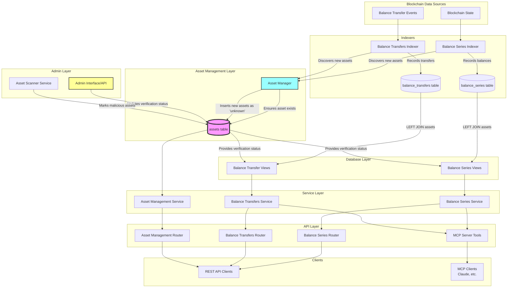

# Asset Contract Data Flow Diagram (Version 2)



## Key Architecture Changes

### 1. Centralized Asset Dictionary
- **Assets Table**: Single source of truth for asset metadata and verification status
- **Asset Manager**: Service that ensures assets exist before indexing data
- **No Duplication**: Base tables (balance_series, balance_transfers) only store asset symbol

### 2. Asset Discovery Flow
```
1. Indexer encounters new asset
2. Asset Manager checks if asset exists in dictionary
3. If not, inserts with 'unknown' status
4. Continues indexing balance/transfer data
```

### 3. Verification Update Flow
```
1. Admin/Scanner identifies asset status
2. Updates assets table with new verification
3. All views immediately reflect new status
4. No need to update historical data
```

### 4. Query Pattern with JOIN
```sql
-- All views now JOIN with assets table
SELECT 
    bs.*,
    COALESCE(a.asset_contract, '') as asset_contract,
    COALESCE(a.asset_verified, 'unknown') as asset_verified
FROM balance_series bs
LEFT JOIN assets a ON bs.asset = a.asset AND a.network = 'torus'
```

## Implementation Example

### Asset Discovery During Indexing
```python
# In Balance Series Indexer
def record_balance_series(self, block_data):
    # Ensure asset exists
    self.asset_manager.ensure_asset_exists(
        asset=self.asset,
        first_seen_block=block_data.height
    )
    
    # Continue with normal indexing
    self._insert_balance_data(block_data)
```

### Admin Verification Update
```python
# Via API endpoint
PUT /substrate/torus/assets/SCAM_TOKEN/verification
{
    "verified": "malicious",
    "updated_by": "security_team",
    "notes": "Confirmed rug pull on 2025-01-04"
}
```

### Real-time Query Results
```json
// Before verification update
{
    "asset": "SCAM_TOKEN",
    "asset_contract": "5Xyz...",
    "asset_verified": "unknown",
    "balance": "1000000"
}

// After verification update (same query)
{
    "asset": "SCAM_TOKEN",
    "asset_contract": "5Xyz...",
    "asset_verified": "malicious",
    "balance": "1000000"
}
```

## Benefits of This Architecture

### 1. **Separation of Concerns**
- Indexers focus on blockchain data
- Asset verification is a separate concern
- Clean, maintainable code

### 2. **Real-time Updates**
- No need to reprocess historical data
- Verification changes immediately visible
- Efficient JOIN operations

### 3. **Audit Trail**
```sql
SELECT 
    asset,
    asset_verified,
    last_updated,
    updated_by,
    notes
FROM assets
WHERE network = 'torus'
ORDER BY last_updated DESC
LIMIT 10;
```

### 4. **Flexible Verification Process**
- Manual admin updates
- Automated scanner services
- Community reporting (future)
- External verification APIs (future)

### 5. **Performance Optimized**
- Small assets table (hundreds/thousands of rows)
- Efficient LEFT JOIN operations
- No impact on indexing speed
- Views can be materialized if needed

## Future Enhancements

### 1. Asset Scanner Service
```python
class AssetScanner:
    def scan_for_malicious_patterns(self):
        # Check for suspicious patterns
        # - Sudden large mints
        # - Honeypot characteristics
        # - Known scam contracts
        # - Community reports
        pass
```

### 2. Verification Webhooks
```python
# Notify when asset status changes
@on_asset_verification_change
def notify_users(asset, old_status, new_status):
    if new_status == 'malicious':
        send_alerts_to_holders(asset)
```

### 3. Asset Metadata Enhancement
```sql
-- Future: Add more metadata
ALTER TABLE assets ADD COLUMN logo_url String;
ALTER TABLE assets ADD COLUMN website String;
ALTER TABLE assets ADD COLUMN social_links String;
ALTER TABLE assets ADD COLUMN total_supply Decimal128(18);
```

### 4. Multi-Network Asset Tracking
```sql
-- Track same asset across networks
CREATE TABLE asset_bridges (
    source_network String,
    source_asset String,
    target_network String,
    target_asset String,
    bridge_contract String,
    PRIMARY KEY (source_network, source_asset, target_network)
);
```

This architecture provides a robust, scalable solution for asset verification while maintaining clean separation between indexing and verification concerns.