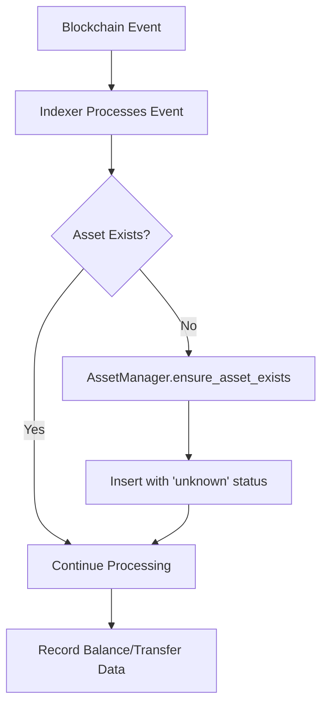
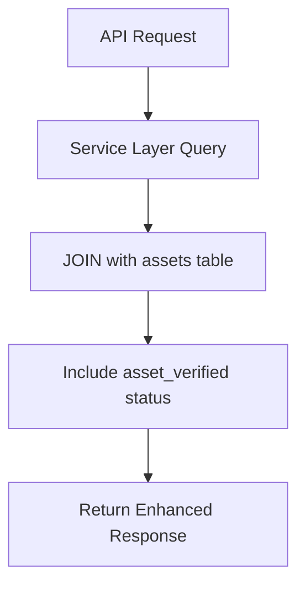
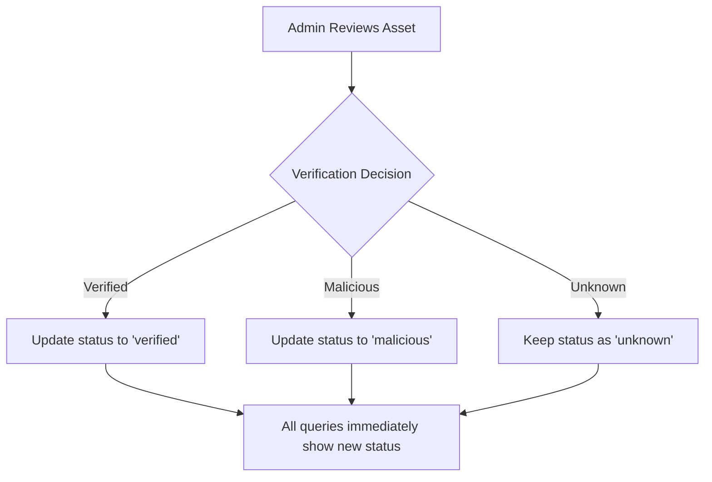

# Asset Contract Implementation Summary

## Overview

This document summarizes the implementation of the asset contract and verification system for the ChainSwarm blockchain indexing platform. The system introduces a centralized `assets` dictionary table that tracks all assets (native and tokens) across different blockchain networks, providing verification status and metadata for enhanced security and transparency.

## Key Features Implemented

1. **Centralized Asset Management**: A single source of truth for all asset information
2. **Asset Verification System**: Three-tier verification status (verified, unknown, malicious)
3. **Automatic Asset Discovery**: Indexers automatically register new assets as they're discovered
4. **Native Asset Pre-verification**: Native blockchain assets (TOR, TAO, DOT) are pre-verified
5. **Real-time Verification Updates**: Changes to asset verification immediately reflected in all queries
6. **Backward Compatible**: Existing queries continue to work with new asset information added

## Modified Files

### Database Schema Files
- `packages/indexers/substrate/assets/schema.sql` - New assets table schema
- `packages/indexers/substrate/balance_series/schema.sql` - Updated views with asset JOINs
- `packages/indexers/substrate/balance_transfers/schema.sql` - Views pending asset JOIN updates

### Indexer Components
- `packages/indexers/substrate/assets/asset_manager.py` - New AssetManager class
- `packages/indexers/substrate/balance_series/balance_series_indexer_base.py` - Updated to use AssetManager
- `packages/indexers/substrate/balance_transfers/balance_transfers_indexer_base.py` - Updated to use AssetManager

### API Service Layer
- `packages/api/services/balance_series_service.py` - Updated queries with asset JOINs
- `packages/api/services/balance_transfers_service.py` - Updated queries with asset JOINs

### API Routers
- `packages/api/routers/balance_series.py` - Added network parameter support
- `packages/api/routers/balance_transfers.py` - Added network parameter support

### MCP Tools
- `packages/api/tools/balance_series.py` - Updated schema descriptions
- `packages/api/tools/balance_transfers.py` - Updated schema descriptions

## Database Changes

### New Assets Table

```sql
CREATE TABLE IF NOT EXISTS assets (
    network String,
    asset_symbol String,  -- Symbol/ticker (e.g., USDT, TAO, TOR)
    asset_contract String,  -- Contract address or 'native' for native assets
    asset_verified String DEFAULT 'unknown',
    asset_name String DEFAULT '',  -- Full display name
    asset_type String DEFAULT 'token',  -- 'native' or 'token'
    decimals UInt8 DEFAULT 0,
    first_seen_block UInt32,
    first_seen_timestamp DateTime,
    last_updated DateTime DEFAULT now(),
    updated_by String DEFAULT 'system',
    notes String DEFAULT '',
    PRIMARY KEY (network, asset_contract),
    CONSTRAINT valid_asset_verified CHECK asset_verified IN ('verified', 'unknown', 'malicious'),
    CONSTRAINT valid_asset_type CHECK asset_type IN ('native', 'token')
) ENGINE = ReplacingMergeTree(last_updated)
ORDER BY (network, asset_contract);
```

### Updated Balance Series Views

All balance series views now JOIN with the assets table to include verification status:

```sql
-- Example: balance_series_latest_view
LEFT JOIN assets a ON bs.asset_contract = a.asset_contract AND a.network = '{network}'
```

### Balance Transfers Views (Pending Update)

The balance transfers views still need to be updated with asset JOINs. This is a remaining task.

## Deployment Instructions

### 1. Drop Existing Tables and Views (if needed)

```sql
-- Drop views first (they depend on tables)
DROP VIEW IF EXISTS balance_series_latest_view;
DROP VIEW IF EXISTS balance_series_daily_view;
DROP VIEW IF EXISTS balance_series_weekly_view;
DROP VIEW IF EXISTS balance_series_monthly_view;

-- Drop materialized views
DROP VIEW IF EXISTS balance_series_weekly_mv_internal;
DROP VIEW IF EXISTS balance_series_monthly_mv_internal;

-- Drop tables if doing a full reset
-- DROP TABLE IF EXISTS balance_series;
-- DROP TABLE IF EXISTS balance_transfers;
```

### 2. Create Assets Table

```bash
# Run the assets schema
clickhouse-client --query "$(cat packages/indexers/substrate/assets/schema.sql)"
```

### 3. Update Balance Series Schema

```bash
# Run the updated balance series schema
clickhouse-client --query "$(cat packages/indexers/substrate/balance_series/schema.sql)"
```

### 4. Update Balance Transfers Schema

```bash
# Run the balance transfers schema (after views are updated)
clickhouse-client --query "$(cat packages/indexers/substrate/balance_transfers/schema.sql)"
```

### 5. Start Indexing

```bash
# Start indexing from block 0 for each network
python -m packages.indexers.substrate.balance_series.balance_series_consumer --network torus
python -m packages.indexers.substrate.balance_transfers.balance_transfers_consumer --network torus
```

## SQL Commands for Asset Management

### View All Assets

```sql
-- View all assets for a network
SELECT * FROM assets WHERE network = 'torus' ORDER BY asset_symbol;

-- View only verified assets
SELECT * FROM assets WHERE network = 'torus' AND asset_verified = 'verified';

-- View suspicious assets
SELECT * FROM assets WHERE asset_verified = 'malicious';
```

### Update Asset Verification

```sql
-- Mark an asset as verified
INSERT INTO assets (network, asset_contract, asset_verified, last_updated, updated_by, notes)
VALUES ('torus', '0x123...', 'verified', now(), 'admin', 'Verified by team');

-- Mark an asset as malicious
INSERT INTO assets (network, asset_contract, asset_verified, last_updated, updated_by, notes)
VALUES ('torus', '0x456...', 'malicious', now(), 'admin', 'Confirmed rug pull - DO NOT TRADE');

-- Update existing asset
ALTER TABLE assets
UPDATE asset_verified = 'malicious', 
       updated_by = 'security_team',
       notes = 'Honeypot contract detected',
       last_updated = now()
WHERE network = 'torus' AND asset_contract = '0x789...';
```

### Bulk Asset Updates

```sql
-- Mark all assets with specific pattern as malicious
ALTER TABLE assets
UPDATE asset_verified = 'malicious',
       updated_by = 'automated_scanner',
       notes = 'Pattern match: known scam naming convention',
       last_updated = now()
WHERE network = 'torus' 
  AND asset_symbol LIKE '%SCAM%'
  AND asset_verified = 'unknown';
```

## API Response Examples

### Balance Series with Asset Information

```json
{
  "items": [
    {
      "period_start_timestamp": 1704067200000,
      "period_end_timestamp": 1704081600000,
      "block_height": 12345,
      "address": "5C4n8kb3mno7i8vQmqNgsQbwZozHvPyou8TAfZfZ7msTkS5f",
      "asset": "TOR",
      "asset_contract": "native",
      "asset_verified": "verified",
      "asset_name": "Torus",
      "free_balance": "1000.5",
      "reserved_balance": "0",
      "staked_balance": "500.25",
      "total_balance": "1500.75",
      "total_balance_change": "50.0",
      "total_balance_percent_change": "3.44"
    }
  ],
  "pagination": {
    "page": 1,
    "page_size": 20,
    "total_pages": 5,
    "total_items": 100
  }
}
```

### Balance Transfers with Asset Information

```json
{
  "items": [
    {
      "extrinsic_id": "0x123...",
      "event_idx": "12345-0",
      "block_height": 12345,
      "block_timestamp": 1704067200000,
      "from_address": "5C4n8kb3mno7i8vQmqNgsQbwZozHvPyou8TAfZfZ7msTkS5f",
      "to_address": "5GrwvaEF5zXb26Fz9rcQpDWS57CtERHpNehXCPcNoHGKutQY",
      "asset": "TOR",
      "asset_contract": "native",
      "asset_verified": "verified",
      "asset_name": "Torus",
      "amount": "100.5",
      "fee": "0.01"
    }
  ],
  "pagination": {
    "page": 1,
    "page_size": 20,
    "total_pages": 10,
    "total_items": 200
  }
}
```

## How the System Works

### 1. Asset Discovery Flow



### 2. Query Flow with Verification



### 3. Asset Verification Update Flow



## Remaining Tasks

1. **Update Balance Transfers Views**: Add asset JOINs to all balance transfers views
2. **Create Asset Management API**: Implement dedicated endpoints for asset management
3. **Add Asset Scanner Service**: Automated detection of suspicious assets
4. **Implement Asset Metadata Enhancement**: Add logos, social links, supply tracking
5. **Create Admin UI**: Web interface for asset verification management
6. **Add Cross-Network Asset Tracking**: Track assets across multiple blockchains

## Performance Considerations

- **JOIN Performance**: LEFT JOINs with the assets table are efficient due to:
  - Small table size (one row per unique asset)
  - Primary key on (network, asset_contract)
  - Bloom filter indexes for quick lookups

- **No Data Duplication**: Asset information is not duplicated in base tables
- **Real-time Updates**: ReplacingMergeTree ensures latest verification status is always used
- **Backward Compatibility**: Existing queries work without modification

## Security Benefits

1. **Malicious Asset Detection**: Ability to flag scam tokens
2. **User Protection**: Clear verification status in all API responses
3. **Audit Trail**: Track who updated verification and when
4. **Flexible Response**: Can quickly respond to new threats

## Migration Notes

- Native assets are automatically initialized as 'verified'
- All new assets discovered start as 'unknown'
- Existing data can be migrated using:

```sql
-- Extract unique assets from existing data
INSERT INTO assets (network, asset_symbol, asset_contract, first_seen_block, first_seen_timestamp)
SELECT 
    'torus' as network,
    asset as asset_symbol,
    asset_contract,
    min(block_height) as first_seen_block,
    min(fromUnixTimestamp64Milli(period_start_timestamp)) as first_seen_timestamp
FROM balance_series
WHERE asset_contract != ''
GROUP BY asset, asset_contract;
```

## Monitoring and Maintenance

- Monitor new asset discovery rate
- Review 'unknown' assets regularly
- Set up alerts for high-volume unknown assets
- Track verification update frequency
- Monitor JOIN query performance

This implementation provides a robust foundation for asset management and verification across the ChainSwarm platform, enhancing security and transparency for all users.