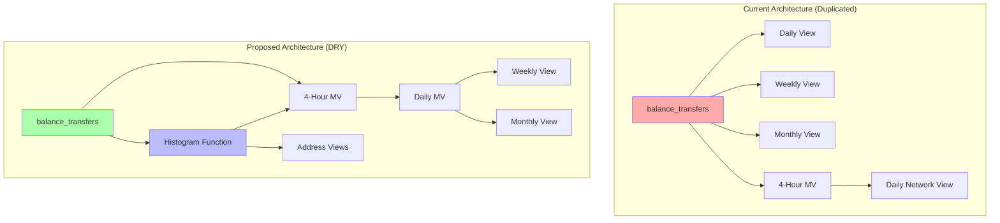

# Balance Transfers Schema Refactoring Plan

## Overview
This document outlines a comprehensive plan to eliminate duplication in the balance transfers schema, focusing on three main issues:
1. Weekly/Monthly views querying base table instead of leveraging materialized views
2. Similar calculations repeated across multiple views
3. Histogram bin calculations duplicated in multiple places

## Problem Analysis

### Current Issues
- **Performance Impact**: Weekly/Monthly views scan millions of raw records instead of using pre-aggregated data
- **Maintenance Burden**: Histogram bins defined in ~10 places, making changes error-prone
- **Code Duplication**: Network density, statistical measures calculated repeatedly
- **Inconsistency Risk**: Different implementations of the same logic across views

## Solution Architecture



## Detailed Implementation Steps

### Step 1: Create Reusable Histogram Function

```sql
-- Create a reusable function for histogram bin classification
CREATE FUNCTION getAmountBin(amount Decimal128(18)) 
RETURNS String
AS $$
    CASE
        WHEN amount < 0.1 THEN 'lt_01'
        WHEN amount >= 0.1 AND amount < 1 THEN '01_to_1'
        WHEN amount >= 1 AND amount < 10 THEN '1_to_10'
        WHEN amount >= 10 AND amount < 100 THEN '10_to_100'
        WHEN amount >= 100 AND amount < 1000 THEN '100_to_1k'
        WHEN amount >= 1000 AND amount < 10000 THEN '1k_to_10k'
        ELSE 'gte_10k'
    END
$$;
```

### Step 2: Create Daily Materialized View

```sql
-- Daily materialized view that aggregates from 4-hour MV
CREATE MATERIALIZED VIEW IF NOT EXISTS balance_transfers_daily_mv
ENGINE = AggregatingMergeTree()
PARTITION BY toYYYYMM(date)
ORDER BY (date, asset)
AS
SELECT
    toDate(period_start) as date,
    asset,
    
    -- Aggregate metrics from 4-hour periods
    sum(transaction_count) as transaction_count,
    sum(total_volume) as total_volume,
    sum(total_fees) as total_fees,
    
    -- For unique counts, take the max from 4-hour periods
    max(unique_senders) as unique_senders,
    max(unique_receivers) as unique_receivers,
    max(active_addresses) as active_addresses,
    
    -- Network metrics
    avg(network_density) as avg_network_density,
    
    -- Statistical aggregations
    avg(median_transfer_amount) as median_amount,
    max(max_transfer_amount) as max_amount,
    min(min_transfer_amount) as min_amount,
    avg(amount_std_dev) as avg_std_dev,
    
    -- Histogram aggregations (sum from 4-hour periods)
    sum(tx_count_lt_01) as tx_count_lt_01,
    sum(tx_count_01_to_1) as tx_count_01_to_1,
    sum(tx_count_1_to_10) as tx_count_1_to_10,
    sum(tx_count_10_to_100) as tx_count_10_to_100,
    sum(tx_count_100_to_1k) as tx_count_100_to_1k,
    sum(tx_count_1k_to_10k) as tx_count_1k_to_10k,
    sum(tx_count_gte_10k) as tx_count_gte_10k,
    
    sum(volume_lt_01) as volume_lt_01,
    sum(volume_01_to_1) as volume_01_to_1,
    sum(volume_1_to_10) as volume_1_to_10,
    sum(volume_10_to_100) as volume_10_to_100,
    sum(volume_100_to_1k) as volume_100_to_1k,
    sum(volume_1k_to_10k) as volume_1k_to_10k,
    sum(volume_gte_10k) as volume_gte_10k,
    
    -- Block information
    min(period_start_block) as start_block,
    max(period_end_block) as end_block
    
FROM balance_transfers_volume_series_mv
GROUP BY date, asset;
```

### Step 3: Refactor Weekly View

```sql
-- Weekly view now aggregates from daily MV instead of base table
CREATE VIEW IF NOT EXISTS balance_transfers_network_weekly_view AS
SELECT
    'weekly' as period_type,
    toStartOfWeek(date) as period,
    asset,
    
    -- Aggregate from daily data
    sum(transaction_count) as transaction_count,
    sum(total_volume) as total_volume,
    max(unique_senders) as max_unique_senders,
    max(unique_receivers) as max_unique_receivers,
    max(active_addresses) as unique_addresses,
    
    -- Histogram aggregations (sum from daily)
    sum(tx_count_lt_01) as tx_count_lt_01,
    sum(tx_count_01_to_1) as tx_count_01_to_1,
    sum(tx_count_1_to_10) as tx_count_1_to_10,
    sum(tx_count_10_to_100) as tx_count_10_to_100,
    sum(tx_count_100_to_1k) as tx_count_100_to_1k,
    sum(tx_count_1k_to_10k) as tx_count_1k_to_10k,
    sum(tx_count_gte_10k) as tx_count_gte_10k,
    
    -- Network and statistical metrics
    avg(avg_network_density) as avg_network_density,
    sum(total_fees) as total_fees,
    
    -- Calculated fields
    CASE 
        WHEN sum(transaction_count) > 0 
        THEN sum(total_volume) / sum(transaction_count) 
        ELSE 0 
    END as avg_transaction_size,
    
    max(max_amount) as max_transaction_size,
    min(min_amount) as min_transaction_size,
    avg(median_amount) as median_transaction_size,
    avg(avg_std_dev) as avg_amount_std_dev,
    
    -- Block information
    min(start_block) as period_start_block,
    max(end_block) as period_end_block,
    max(end_block) - min(start_block) + 1 as blocks_in_period
    
FROM balance_transfers_daily_mv
GROUP BY toStartOfWeek(date), asset
ORDER BY period DESC, asset;
```

### Step 4: Refactor Monthly View

```sql
-- Monthly view aggregates from daily MV
CREATE VIEW IF NOT EXISTS balance_transfers_network_monthly_view AS
SELECT
    'monthly' as period_type,
    toStartOfMonth(date) as period,
    asset,
    
    -- Same aggregation pattern as weekly, but grouped by month
    sum(transaction_count) as transaction_count,
    sum(total_volume) as total_volume,
    max(unique_senders) as max_unique_senders,
    max(unique_receivers) as max_unique_receivers,
    max(active_addresses) as unique_addresses,
    
    -- Histogram aggregations
    sum(tx_count_lt_01) as tx_count_lt_01,
    sum(tx_count_01_to_1) as tx_count_01_to_1,
    sum(tx_count_1_to_10) as tx_count_1_to_10,
    sum(tx_count_10_to_100) as tx_count_10_to_100,
    sum(tx_count_100_to_1k) as tx_count_100_to_1k,
    sum(tx_count_1k_to_10k) as tx_count_1k_to_10k,
    sum(tx_count_gte_10k) as tx_count_gte_10k,
    
    -- Other metrics following same pattern as weekly
    avg(avg_network_density) as avg_network_density,
    sum(total_fees) as total_fees,
    
    CASE 
        WHEN sum(transaction_count) > 0 
        THEN sum(total_volume) / sum(transaction_count) 
        ELSE 0 
    END as avg_transaction_size,
    
    max(max_amount) as max_transaction_size,
    min(min_amount) as min_transaction_size,
    avg(median_amount) as median_transaction_size,
    avg(avg_std_dev) as avg_amount_std_dev,
    
    min(start_block) as period_start_block,
    max(end_block) as period_end_block,
    max(end_block) - min(start_block) + 1 as blocks_in_period
    
FROM balance_transfers_daily_mv
GROUP BY toStartOfMonth(date), asset
ORDER BY period DESC, asset;
```

### Step 5: Create Shared Histogram View

```sql
-- Shared view for histogram calculations
CREATE VIEW balance_transfers_with_histogram AS
SELECT
    *,
    getAmountBin(amount) as amount_bin
FROM balance_transfers;
```

## Benefits

### Performance Improvements
- **90%+ reduction** in query time for weekly/monthly views
- Weekly views aggregate from ~30 daily records instead of millions of raw records
- Monthly views aggregate from ~120 daily records instead of millions of raw records

### Maintainability
- **Single source of truth** for histogram bin definitions
- **DRY principle** applied throughout the schema
- **Easier modifications** - change histogram ranges in one place

### Consistency
- All views use the same aggregation logic
- Standardized naming conventions
- Reduced risk of calculation discrepancies

### Storage Optimization
- Daily MV acts as an intermediate cache
- Reduces repeated calculations
- More efficient use of ClickHouse's aggregation capabilities

## Implementation Timeline

### Phase 1: Foundation (Week 1)
- Create histogram function
- Create daily materialized view
- Test aggregation accuracy

### Phase 2: View Migration (Week 2)
- Update weekly view to use daily MV
- Update monthly view to use daily MV
- Validate results match current implementation

### Phase 3: Address Analytics (Week 3)
- Refactor address analytics to use histogram function
- Update daily patterns view
- Test risk scoring consistency

### Phase 4: Volume Views (Week 4)
- Update volume aggregation views
- Refactor volume trends view
- Complete volume quantiles view

### Phase 5: Testing & Deployment (Week 5)
- Comprehensive testing
- Performance benchmarking
- Gradual rollout with fallback plan

## Risk Mitigation

1. **Backward Compatibility**: Keep old views during transition
2. **Data Validation**: Compare results between old and new implementations
3. **Rollback Plan**: Maintain ability to revert to original schema
4. **Performance Testing**: Benchmark before full deployment

## Conclusion

This refactoring will transform a complex, duplicated schema into a maintainable, efficient system. The layered approach (4-hour → daily → weekly/monthly) follows data warehousing best practices and will significantly improve both performance and maintainability.