# Comprehensive ClickHouse Views Plan for Balance Tracking
## Optimized for LLM Agents, RAG & Vector Search

### Executive Summary

This document outlines a comprehensive set of ClickHouse views, materialized views, and incremental views designed to enhance the existing balance tracking schema for optimal use with LLM agents, RAG (Retrieval-Augmented Generation) systems, and vector search capabilities. The plan covers four key areas: Financial Analysis & Anomaly Detection, Network Analysis & Relationship Mapping, Time-Series Analysis & Trend Prediction, and Semantic Search & Natural Language Query optimization.

### Current Schema Analysis

The existing [`balance_tracking/schema.sql`](packages/indexers/substrate/balance_tracking/schema.sql) provides:

**Core Tables:**
- [`balance_changes`](packages/indexers/substrate/balance_tracking/schema.sql:6) - Current balance state for addresses at specific block heights
- [`balance_delta_changes`](packages/indexers/substrate/balance_tracking/schema.sql:36) - Changes in balances between consecutive blocks  
- [`balance_transfers`](packages/indexers/substrate/balance_tracking/schema.sql:63) - Individual transfer transactions between addresses

**Existing Views:**
- [`balances_current_view`](packages/indexers/substrate/balance_tracking/schema.sql:91) - Latest balance for each address and asset
- [`balance_significant_changes_view`](packages/indexers/substrate/balance_tracking/schema.sql:105) - Significant balance changes
- [`balance_transfers_statistics_view`](packages/indexers/substrate/balance_tracking/schema.sql:121) - Transfer statistics by address and asset
- [`balance_daily_statistics_mv`](packages/indexers/substrate/balance_tracking/schema.sql:140) - Daily balance statistics (materialized)
- [`balance_transfers_daily_volume_mv`](packages/indexers/substrate/balance_tracking/schema.sql:157) - Daily transfer volume (materialized)

### Architecture Overview

```mermaid
graph TB
    subgraph "Core Tables"
        BC[balance_changes]
        BDC[balance_delta_changes] 
        BT[balance_transfers]
    end
    
    subgraph "Financial Analysis Views"
        FA1[whale_activity_view]
        FA2[anomaly_detection_mv]
        FA3[balance_distribution_view]
        FA4[risk_scoring_view]
        FA5[portfolio_analysis_mv]
    end
    
    subgraph "Network Analysis Views"
        NA1[address_relationships_mv]
        NA2[transaction_flow_patterns_view]
        NA3[address_clusters_mv]
        NA4[centrality_metrics_mv]
        NA5[money_flow_graph_mv]
    end
    
    subgraph "Time Series Views"
        TS1[balance_trends_mv]
        TS2[seasonal_patterns_mv]
        TS3[volatility_metrics_mv]
        TS4[growth_analysis_mv]
        TS5[trend_prediction_mv]
    end
    
    subgraph "Semantic Search Views"
        SS1[address_behavioral_profiles_mv]
        SS2[transaction_pattern_embeddings_mv]
        SS3[similarity_vectors_mv]
        SS4[llm_address_summary_view]
        SS5[rag_context_mv]
    end
    
    BC --> FA1
    BC --> FA2
    BC --> FA3
    BDC --> FA4
    BC --> FA5
    BT --> NA1
    BT --> NA2
    BC --> NA3
    BT --> NA4
    BT --> NA5
    BC --> TS1
    BDC --> TS2
    BC --> TS3
    BDC --> TS4
    BC --> TS5
    BC --> SS1
    BT --> SS2
    BC --> SS3
    BC --> SS4
    BC --> SS5
```



## 1. Financial Analysis & Anomaly Detection Views

### 1.1 Whale Activity Detection View

**Purpose:** Identify large holders and categorize addresses by balance percentiles for whale tracking.

```sql
CREATE VIEW IF NOT EXISTS whale_activity_view AS
SELECT
    address,
    asset,
    total_balance,
    free_balance,
    staked_balance,
    reserved_balance,
    
    -- Percentile ranking within asset
    percent_rank() OVER (PARTITION BY asset ORDER BY total_balance) as balance_percentile,
    
    -- Whale categorization
    CASE 
        WHEN balance_percentile >= 0.999 THEN 'mega_whale'
        WHEN balance_percentile >= 0.99 THEN 'whale'
        WHEN balance_percentile >= 0.95 THEN 'large_holder'
        WHEN balance_percentile >= 0.80 THEN 'medium_holder'
        ELSE 'regular_holder'
    END as holder_category,
    
    -- Balance composition analysis
    free_balance / nullIf(total_balance, 0) as free_balance_ratio,
    staked_balance / nullIf(total_balance, 0) as staked_balance_ratio,
    reserved_balance / nullIf(total_balance, 0) as reserved_balance_ratio,
    
    -- Concentration metrics
    total_balance / (SELECT sum(total_balance) FROM balances_current_view WHERE asset = bc.asset) as asset_concentration
    
FROM balances_current_view bc
WHERE total_balance > 0
ORDER BY asset, total_balance DESC;
```

### 1.2 Anomaly Detection Materialized View

**Purpose:** Real-time anomaly detection based on historical balance change patterns.

```sql
CREATE MATERIALIZED VIEW IF NOT EXISTS anomaly_detection_mv
ENGINE = AggregatingMergeTree()
PARTITION BY toYYYYMM(date)
ORDER BY (date, asset, anomaly_score DESC)
SETTINGS index_granularity = 8192
AS
SELECT
    toDate(intDiv(block_timestamp, 1000)) as date,
    address,
    asset,
    block_height,
    block_timestamp,
    
    -- Change magnitude metrics
    abs(total_balance_delta) as change_magnitude,
    abs(free_balance_delta) as free_change_magnitude,
    abs(staked_balance_delta) as staked_change_magnitude,
    abs(reserved_balance_delta) as reserved_change_magnitude,
    
    -- Historical context (30-day rolling average)
    avg(abs(total_balance_delta)) OVER (
        PARTITION BY address, asset 
        ORDER BY block_height 
        ROWS BETWEEN 720 PRECEDING AND 1 PRECEDING  -- ~30 days assuming 24 blocks/hour
    ) as avg_historical_change,
    
    -- Anomaly scoring
    change_magnitude / nullIf(avg_historical_change, 0) as anomaly_score,
    
    -- Anomaly classification
    CASE
        WHEN anomaly_score > 10 THEN 'extreme_anomaly'
        WHEN anomaly_score > 5 THEN 'high_anomaly'
        WHEN anomaly_score > 3 THEN 'moderate_anomaly'
        WHEN anomaly_score > 2 THEN 'mild_anomaly'
        ELSE 'normal'
    END as anomaly_level,
    
    -- Context flags
    CASE WHEN total_balance_delta > 0 THEN 'increase' ELSE 'decrease' END as change_direction,
    previous_block_height
    
FROM balance_delta_changes
WHERE abs(total_balance_delta) > 0;
```

### 1.3 Balance Distribution Analysis View

**Purpose:** Statistical analysis of balance distributions across assets for inequality metrics.

```sql
CREATE VIEW IF NOT EXISTS balance_distribution_view AS
SELECT
    asset,
    
    -- Basic statistics
    count() as total_addresses,
    sum(total_balance) as total_supply,
    avg(total_balance) as mean_balance,
    median(total_balance) as median_balance,
    
    -- Percentile analysis
    quantile(0.1)(total_balance) as p10_balance,
    quantile(0.25)(total_balance) as p25_balance,
    quantile(0.75)(total_balance) as p75_balance,
    quantile(0.9)(total_balance) as p90_balance,
    quantile(0.95)(total_balance) as p95_balance,
    quantile(0.99)(total_balance) as p99_balance,
    quantile(0.999)(total_balance) as p999_balance,
    
    -- Inequality metrics
    stddevPop(total_balance) as balance_std_dev,
    p90_balance / nullIf(p10_balance, 0) as p90_p10_ratio,
    p99_balance / nullIf(median_balance, 0) as p99_median_ratio,
    
    -- Concentration analysis
    sumIf(total_balance, total_balance >= p99_balance) / nullIf(total_supply, 0) as top1_pct_concentration,
    sumIf(total_balance, total_balance >= p95_balance) / nullIf(total_supply, 0) as top5_pct_concentration,
    sumIf(total_balance, total_balance >= p90_balance) / nullIf(total_supply, 0) as top10_pct_concentration,
    
    -- Balance type analysis
    avg(free_balance / nullIf(total_balance, 0)) as avg_free_ratio,
    avg(staked_balance / nullIf(total_balance, 0)) as avg_staked_ratio,
    avg(reserved_balance / nullIf(total_balance, 0)) as avg_reserved_ratio
    
FROM balances_current_view
WHERE total_balance > 0
GROUP BY asset
ORDER BY total_supply DESC;
```

### 1.4 Portfolio Analysis Materialized View

**Purpose:** Multi-asset portfolio analysis for addresses holding multiple assets.

```sql
CREATE MATERIALIZED VIEW IF NOT EXISTS portfolio_analysis_mv
ENGINE = AggregatingMergeTree()
ORDER BY (address, portfolio_value DESC)
SETTINGS index_granularity = 8192
AS
SELECT
    address,
    
    -- Portfolio diversity
    count() as asset_count,
    uniqExact(asset) as unique_assets,
    
    -- Portfolio value (assuming normalized pricing)
    sum(total_balance) as portfolio_value,
    max(total_balance) as largest_holding,
    min(total_balance) as smallest_holding,
    
    -- Concentration metrics
    largest_holding / nullIf(portfolio_value, 0) as concentration_ratio,
    entropy(total_balance) as portfolio_entropy,
    
    -- Balance type distribution
    sum(free_balance) as total_free,
    sum(staked_balance) as total_staked,
    sum(reserved_balance) as total_reserved,
    
    total_free / nullIf(portfolio_value, 0) as portfolio_free_ratio,
    total_staked / nullIf(portfolio_value, 0) as portfolio_staked_ratio,
    total_reserved / nullIf(portfolio_value, 0) as portfolio_reserved_ratio,
    
    -- Portfolio classification
    CASE
        WHEN asset_count = 1 THEN 'single_asset'
        WHEN asset_count <= 3 THEN 'focused_portfolio'
        WHEN asset_count <= 10 THEN 'diversified_portfolio'
        ELSE 'highly_diversified'
    END as portfolio_type,
    
    groupArray(asset) as assets_held,
    groupArray(total_balance) as asset_balances
    
FROM balances_current_view
WHERE total_balance > 0
GROUP BY address
HAVING asset_count > 0;
```

### 1.5 Risk Scoring View

**Purpose:** Comprehensive risk assessment combining multiple risk factors.

```sql
CREATE VIEW IF NOT EXISTS risk_scoring_view AS
SELECT
    address,
    asset,
    
    -- Anomaly-based risk factors
    CASE WHEN anomaly_score > 5 THEN 1.0 ELSE anomaly_score / 5.0 END as anomaly_risk_factor,
    
    -- Concentration-based risk factors  
    CASE WHEN asset_concentration > 0.01 THEN 1.0 ELSE asset_concentration * 100 END as concentration_risk_factor,
    
    -- Volatility-based risk factors
    CASE WHEN holder_category IN ('mega_whale', 'whale') THEN 0.8 ELSE 0.2 END as whale_risk_factor,
    
    -- Balance composition risk
    CASE 
        WHEN free_balance_ratio > 0.9 THEN 0.3  -- High liquidity = lower risk
        WHEN staked_balance_ratio > 0.7 THEN 0.1  -- High staking = lower risk
        ELSE 0.5
    END as composition_risk_factor,
    
    -- Composite risk score (weighted average)
    (anomaly_risk_factor * 0.4 + 
     concentration_risk_factor * 0.3 + 
     whale_risk_factor * 0.2 + 
     composition_risk_factor * 0.1) as composite_risk_score,
    
    -- Risk classification
    CASE
        WHEN composite_risk_score >= 0.8 THEN 'very_high_risk'
        WHEN composite_risk_score >= 0.6 THEN 'high_risk'
        WHEN composite_risk_score >= 0.4 THEN 'medium_risk'
        WHEN composite_risk_score >= 0.2 THEN 'low_risk'
        ELSE 'very_low_risk'
    END as risk_category,
    
    -- Risk factors breakdown
    map(
        'anomaly_risk', toString(round(anomaly_risk_factor, 3)),
        'concentration_risk', toString(round(concentration_risk_factor, 3)),
        'whale_risk', toString(round(whale_risk_factor, 3)),
        'composition_risk', toString(round(composition_risk_factor, 3))
    ) as risk_factors_breakdown
    
FROM whale_activity_view w
LEFT JOIN (
    SELECT address, asset, max(anomaly_score) as anomaly_score
    FROM anomaly_detection_mv 
    WHERE date >= today() - 30
    GROUP BY address, asset
) a ON w.address = a.address AND w.asset = a.asset;
```

## 2. Network Analysis & Relationship Mapping Views

### 2.1 Address Relationships Materialized View

**Purpose:** Build a comprehensive graph of address relationships based on transaction history.

```sql
CREATE MATERIALIZED VIEW IF NOT EXISTS address_relationships_mv
ENGINE = AggregatingMergeTree()
PARTITION BY asset
ORDER BY (from_address, to_address, asset)
SETTINGS index_granularity = 8192
AS
SELECT
    from_address,
    to_address,
    asset,
    
    -- Transaction frequency metrics
    count() as transaction_count,
    uniqExact(toDate(intDiv(block_timestamp, 1000))) as active_days,
    max(block_timestamp) - min(block_timestamp) as relationship_duration_seconds,
    
    -- Volume metrics
    sum(amount) as total_volume,
    avg(amount) as avg_amount,
    median(amount) as median_amount,
    min(amount) as min_amount,
    max(amount) as max_amount,
    stddevPop(amount) as amount_volatility,
    
    -- Fee analysis
    sum(fee) as total_fees,
    avg(fee) as avg_fee,
    sum(fee) / nullIf(sum(amount), 0) as fee_ratio,
    
    -- Temporal patterns
    min(block_timestamp) as first_interaction,
    max(block_timestamp) as last_interaction,
    argMax(block_height, block_timestamp) as last_block_height,
    
    -- Activity patterns
    uniqExact(toHour(toDateTime(intDiv(block_timestamp, 1000)))) as active_hours,
    uniqExact(toDayOfWeek(toDate(intDiv(block_timestamp, 1000)))) as active_days_of_week,
    
    -- Relationship strength scoring
    ln(transaction_count + 1) * ln(total_volume + 1) * ln(active_days + 1) as relationship_strength,
    
    -- Relationship classification
    CASE
        WHEN transaction_count >= 100 AND total_volume >= 10000 THEN 'strong_relationship'
        WHEN transaction_count >= 50 OR total_volume >= 5000 THEN 'moderate_relationship'
        WHEN transaction_count >= 10 OR total_volume >= 1000 THEN 'weak_relationship'
        ELSE 'minimal_relationship'
    END as relationship_type
    
FROM balance_transfers
GROUP BY from_address, to_address, asset
HAVING transaction_count > 0;
```

### 2.2 Transaction Flow Patterns View

**Purpose:** Analyze transaction flow patterns for each address to identify behavioral signatures.

```sql
CREATE VIEW IF NOT EXISTS transaction_flow_patterns_view AS
SELECT
    address,
    asset,
    
    -- Directional transaction counts
    countIf(direction = 'outgoing') as outgoing_count,
    countIf(direction = 'incoming') as incoming_count,
    outgoing_count + incoming_count as total_transactions,
    
    -- Volume analysis
    sumIf(amount, direction = 'outgoing') as total_sent,
    sumIf(amount, direction = 'incoming') as total_received,
    total_sent + total_received as total_volume,
    
    -- Flow ratios
    total_received / nullIf(total_sent, 0) as receive_send_ratio,
    incoming_count / nullIf(outgoing_count, 0) as in_out_count_ratio,
    
    -- Network reach
    uniqExactIf(counterpart, direction = 'outgoing') as unique_recipients,
    uniqExactIf(counterpart, direction = 'incoming') as unique_senders,
    unique_recipients + unique_senders as total_unique_counterparts,
    
    -- Average transaction sizes
    avgIf(amount, direction = 'outgoing') as avg_sent_amount,
    avgIf(amount, direction = 'incoming') as avg_received_amount,
    
    -- Fee analysis
    sumIf(fee, direction = 'outgoing') as total_fees_paid,
    avgIf(fee, direction = 'outgoing') as avg_fee_paid,
    total_fees_paid / nullIf(total_sent, 0) as fee_to_volume_ratio,
    
    -- Temporal analysis
    min(block_timestamp) as first_activity,
    max(block_timestamp) as last_activity,
    max(block_timestamp) - min(block_timestamp) as activity_span_seconds,
    uniqExact(toDate(intDiv(block_timestamp, 1000))) as active_days,
    
    -- Activity intensity
    total_transactions / nullIf(active_days, 0) as avg_daily_transactions,
    total_volume / nullIf(active_days, 0) as avg_daily_volume,
    
    -- Flow pattern classification
    CASE
        WHEN receive_send_ratio > 10 THEN 'accumulator'
        WHEN receive_send_ratio < 0.1 THEN 'distributor'
        WHEN unique_recipients > 100 THEN 'hub'
        WHEN unique_senders > 100 THEN 'collector'
        WHEN total_transactions > 1000 THEN 'high_activity'
        ELSE 'regular'
    END as flow_pattern_type
    
FROM (
    SELECT 
        from_address as address, 
        to_address as counterpart, 
        asset, 
        amount, 
        fee, 
        block_timestamp,
        'outgoing' as direction 
    FROM balance_transfers
    
    UNION ALL
    
    SELECT 
        to_address as address, 
        from_address as counterpart, 
        asset, 
        amount, 
        0 as fee, 
        block_timestamp,
        'incoming' as direction 
    FROM balance_transfers
)
GROUP BY address, asset
HAVING total_transactions > 0;
```

### 2.3 Address Clusters Materialized View

**Purpose:** Identify clusters of related addresses using graph analysis techniques.

```sql
CREATE MATERIALIZED VIEW IF NOT EXISTS address_clusters_mv
ENGINE = AggregatingMergeTree()
ORDER BY (asset, cluster_id, cluster_size DESC)
SETTINGS index_granularity = 8192
AS
WITH cluster_analysis AS (
    SELECT
        address,
        asset,
        groupArray(counterpart) as connected_addresses,
        arrayJoin(connected_addresses) as cluster_member
    FROM (
        SELECT from_address as address, to_address as counterpart, asset
        FROM address_relationships_mv
        WHERE relationship_strength > 100  -- Strong relationships only
        
        UNION ALL
        
        SELECT to_address as address, from_address as counterpart, asset
        FROM address_relationships_mv
        WHERE relationship_strength > 100
    )
    GROUP BY address, asset
)
SELECT
    address,
    asset,
    
    -- Simple clustering based on shared counterparts
    cityHash64(arraySort(groupUniqArray(cluster_member))) as cluster_id,
    count() OVER (PARTITION BY cluster_id, asset) as cluster_size,
    
    -- Cluster metrics
    sum(total_volume) OVER (PARTITION BY cluster_id, asset) as cluster_total_volume,
    avg(total_volume) OVER (PARTITION BY cluster_id, asset) as cluster_avg_volume,
    uniqExact(flow_pattern_type) OVER (PARTITION BY cluster_id, asset) as cluster_pattern_diversity,
    
    -- Address role in cluster
    total_volume / nullIf(cluster_total_volume, 0) as cluster_volume_share,
    
    CASE
        WHEN cluster_volume_share > 0.5 THEN 'cluster_leader'
        WHEN cluster_volume_share > 0.2 THEN 'major_member'
        WHEN cluster_volume_share > 0.05 THEN 'active_member'
        ELSE 'minor_member'
    END as cluster_role
    
FROM cluster_analysis ca
JOIN transaction_flow_patterns_view tfp ON ca.address = tfp.address AND ca.asset = tfp.asset
GROUP BY address, asset, cluster_id;
```

### 2.4 Centrality Metrics Materialized View

**Purpose:** Calculate network centrality metrics to identify important nodes in the transaction graph.

```sql
CREATE MATERIALIZED VIEW IF NOT EXISTS centrality_metrics_mv
ENGINE = AggregatingMergeTree()
ORDER BY (asset, betweenness_centrality DESC)
SETTINGS index_granularity = 8192
AS
SELECT
    address,
    asset,
    
    -- Degree centrality (number of unique connections)
    unique_recipients + unique_senders as degree_centrality,
    unique_recipients as out_degree,
    unique_senders as in_degree,
    
    -- Weighted degree centrality (volume-weighted connections)
    total_volume as weighted_degree_centrality,
    total_sent as weighted_out_degree,
    total_received as weighted_in_degree,
    
    -- Approximated betweenness centrality (based on transaction volume flow)
    (total_volume * total_unique_counterparts) / 
    nullIf((SELECT sum(total_volume) FROM transaction_flow_patterns_view WHERE asset = tfp.asset), 0) 
    as betweenness_centrality,
    
    -- Closeness centrality approximation (inverse of average path length)
    1.0 / nullIf(avg_daily_transactions, 0) as closeness_centrality,
    
    -- PageRank approximation (importance based on incoming connections)
    (total_received * unique_senders) / 
    nullIf((SELECT sum(total_received) FROM transaction_flow_patterns_view WHERE asset = tfp.asset), 0)
    as pagerank_score,
    
    -- Eigenvector centrality approximation
    sqrt(total_volume * total_unique_counterparts) as eigenvector_centrality,
    
    -- Hub and authority scores (HITS algorithm approximation)
    sqrt(unique_recipients * total_sent) as hub_score,
    sqrt(unique_senders * total_received) as authority_score,
    
    -- Centrality classification
    CASE
        WHEN betweenness_centrality > 0.001 THEN 'critical_bridge'
        WHEN degree_centrality > 1000 THEN 'super_hub'
        WHEN degree_centrality > 100 THEN 'hub'
        WHEN pagerank_score > 0.0001 THEN 'important_node'
        ELSE 'regular_node'
    END as centrality_class,
    
    -- Network role identification
    CASE
        WHEN hub_score > authority_score * 2 THEN 'hub'
        WHEN authority_score > hub_score * 2 THEN 'authority'
        WHEN betweenness_centrality > 0.0001 THEN 'bridge'
        ELSE 'regular'
    END as network_role
    
FROM transaction_flow_patterns_view tfp
WHERE total_transactions > 10;  -- Filter out low-activity addresses
```

### 2.5 Money Flow Graph Materialized View

**Purpose:** Create a comprehensive money flow graph for advanced network analysis.

```sql
CREATE MATERIALIZED VIEW IF NOT EXISTS money_flow_graph_mv
ENGINE = AggregatingMergeTree()
ORDER BY (asset, flow_strength DESC)
SETTINGS index_granularity = 8192
AS
SELECT
    from_address,
    to_address,
    asset,
    
    -- Flow strength metrics
    total_volume as flow_strength,
    transaction_count as flow_frequency,
    relationship_duration_seconds / 86400 as flow_duration_days,
    
    -- Flow efficiency
    total_volume / nullIf(transaction_count, 0) as avg_flow_size,
    total_fees / nullIf(total_volume, 0) as flow_cost_ratio,
    
    -- Temporal flow patterns
    active_days / nullIf(flow_duration_days, 0) as flow_consistency,
    
    -- Flow classification
    CASE
        WHEN flow_strength > 100000 AND flow_frequency > 100 THEN 'major_flow'
        WHEN flow_strength > 10000 OR flow_frequency > 50 THEN 'significant_flow'
        WHEN flow_strength > 1000 OR flow_frequency > 10 THEN 'moderate_flow'
        ELSE 'minor_flow'
    END as flow_category,
    
    -- Network position metrics
    (SELECT degree_centrality FROM centrality_metrics_mv WHERE address = from_address AND asset = mf.asset) as from_centrality,
    (SELECT degree_centrality FROM centrality_metrics_mv WHERE address = to_address AND asset = mf.asset) as to_centrality,
    
    -- Flow importance score
    ln(flow_strength + 1) * ln(flow_frequency + 1) * 
    ln(greatest(from_centrality, to_centrality) + 1) as flow_importance_score
    
FROM address_relationships_mv mf
WHERE relationship_strength > 10;  -- Filter weak relationships
```

## 3. Time-Series Analysis & Trend Prediction Views

### 3.1 Balance Trends Materialized View

**Purpose:** Track balance evolution over time with trend analysis capabilities.

```sql
CREATE MATERIALIZED VIEW IF NOT EXISTS balance_trends_mv
ENGINE = AggregatingMergeTree()
PARTITION BY (asset, toYYYYMM(date))
ORDER BY (address, asset, date)
SETTINGS index_granularity = 8192
AS
SELECT
    address,
    asset,
    toDate(intDiv(block_timestamp, 1000)) as date,
    
    -- Daily balance metrics
    argMax(total_balance, block_height) as closing_balance,
    argMax(free_balance, block_height) as closing_free_balance,
    argMax(staked_balance, block_height) as closing_staked_balance,
    argMax(reserved_balance, block_height) as closing_reserved_balance,
    
    min(total_balance) as daily_min_balance,
    max(total_balance) as daily_max_balance,
    max(total_balance) - min(total_balance) as daily_balance_range,
    
    -- Daily changes
    closing_balance - lag(closing_balance, 1) OVER (
        PARTITION BY address, asset ORDER BY date
    ) as daily_change,
    
    daily_change / nullIf(lag(closing_balance, 1) OVER (
        PARTITION BY address, asset ORDER BY date
    ), 0) as daily_change_pct,
    
    -- Moving averages
    avg(closing_balance) OVER (
        PARTITION BY address, asset 
        ORDER BY date 
        ROWS BETWEEN 6 PRECEDING AND CURRENT ROW
    ) as ma_7_day,
    
    avg(closing_balance) OVER (
        PARTITION BY address, asset 
        ORDER BY date 
        ROWS BETWEEN 29 PRECEDING AND CURRENT ROW
    ) as ma_30_day,
    
    -- Trend indicators
    CASE
        WHEN closing_balance > ma_7_day AND ma_7_day > ma_30_day THEN 'strong_uptrend'
        WHEN closing_balance > ma_7_day THEN 'uptrend'
        WHEN closing_balance < ma_7_day AND ma_7_day < ma_30_day THEN 'strong_downtrend'
        WHEN closing_balance < ma_7_day THEN 'downtrend'
        ELSE 'sideways'
    END as trend_direction,
    
    -- Volatility metrics
    stddevPop(daily_change_pct) OVER (
        PARTITION BY address, asset 
        ORDER BY date 
        ROWS BETWEEN 29 PRECEDING AND CURRENT ROW
    ) as volatility_30_day,
    
    max(block_height) as last_block_of_day
    
FROM balance_changes
GROUP BY address, asset, date
HAVING closing_balance > 0;
```

### 3.2 Seasonal Patterns Materialized View

**Purpose:** Identify seasonal and cyclical patterns in transaction behavior.

```sql
CREATE MATERIALIZED VIEW IF NOT EXISTS seasonal_patterns_mv
ENGINE = AggregatingMergeTree()
ORDER BY (asset, day_of_week, hour_of_day)
SETTINGS index_granularity = 8192
AS
SELECT
    asset,
    
    -- Temporal dimensions
    toDayOfWeek(toDate(intDiv(block_timestamp, 1000))) as day_of_week,
    toHour(toDateTime(intDiv(block_timestamp, 1000))) as hour_of_day,
    toMonth(toDate(intDiv(block_timestamp, 1000))) as month,
    toDayOfMonth(toDate(intDiv(block_timestamp, 1000))) as day_of_month,
    
    -- Transaction metrics
    count() as transaction_count,
    sum(amount) as total_volume,
    avg(amount) as avg_amount,
    median(amount) as median_amount,
    
    -- Network activity
    uniqExact(from_address) as unique_senders,
    uniqExact(to_address) as unique_receivers,
    uniqExact(from_address) + uniqExact(to_address) as unique_participants,
    
    -- Fee patterns
    sum(fee) as total_fees,
    avg(fee) as avg_fee,
    sum(fee) / nullIf(sum(amount), 0) as avg_fee_ratio,
    
    -- Activity intensity scoring
    transaction_count / (SELECT avg(transaction_count) 
                        FROM seasonal_patterns_mv 
                        WHERE asset = sp.asset) as activity_intensity_score,
    
    -- Pattern classification
    CASE
        WHEN day_of_week IN (6, 7) THEN 'weekend_pattern'
        WHEN day_of_week IN (6, 7) THEN 'weekend_pattern'
        WHEN