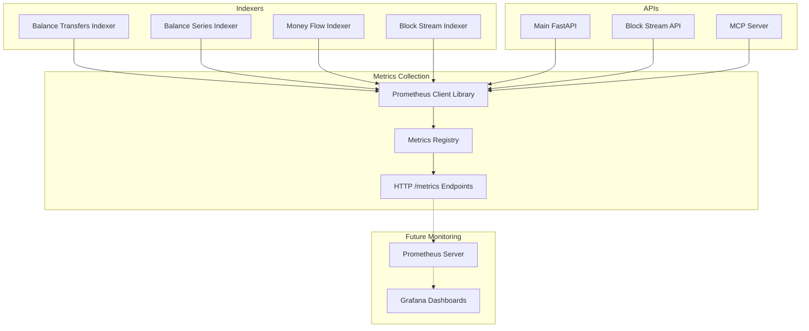

# Prometheus Metrics Collection Plan

## Overview

This document outlines the comprehensive plan for adding Prometheus metrics collection to the ChainSwarm blockchain indexing and API system. The implementation follows the existing logging conventions and provides observability for indexers, APIs, and MCP server components.

## Architecture Analysis

### Current System Components

1. **Indexers**: Multiple substrate blockchain indexers processing blocks in batches
   - Balance transfers indexer
   - Balance series indexer  
   - Money flow indexer
   - Block stream indexer

2. **APIs**: FastAPI applications with middleware
   - Main API (`main.py`)
   - Block stream API (`block_stream_main.py`)
   - Rate limiting middleware

3. **MCP Server**: Model Context Protocol server for blockchain analytics

4. **Logging**: Consistent setup using loguru with service naming like `substrate-{network}-balance-transfers`

## Metrics Collection Strategy

### Approach: Pull-Based HTTP Endpoints

- **Simple to implement**: No additional infrastructure required initially
- **Standard Prometheus pattern**: Each service exposes `/metrics` endpoint
- **Scalable**: Can migrate to push-based (Pushgateway) later if needed
- **Consistent with existing patterns**: Follows same naming conventions as logging

### Implementation Architecture



## Detailed Metrics Specification

### 1. Indexer Metrics

#### Block Processing Metrics
```python
# Core processing metrics
indexer_blocks_processed_total{network="torus", indexer="balance_transfers"}
indexer_current_block_height{network="torus", indexer="balance_transfers"}
indexer_blocks_behind_latest{network="torus", indexer="balance_transfers"}
indexer_block_processing_duration_seconds{network="torus", indexer="balance_transfers"}
indexer_processing_rate_blocks_per_second{network="torus", indexer="balance_transfers"}
indexer_batch_size{network="torus", indexer="balance_transfers"}

# Event processing metrics
indexer_events_processed_total{network="torus", indexer="balance_transfers", event_type="Balances.Transfer"}
indexer_transfers_extracted_total{network="torus", indexer="balance_transfers"}
indexer_failed_events_total{network="torus", indexer="balance_transfers", error_type="validation_error"}
```

#### Database Operation Metrics
```python
# Database performance
indexer_database_inserts_total{network="torus", indexer="balance_transfers", table="balance_transfers"}
indexer_database_query_duration_seconds{network="torus", indexer="balance_transfers", operation="insert"}
indexer_database_connection_errors_total{network="torus", indexer="balance_transfers", error_type="timeout"}
indexer_database_active_connections{network="torus", indexer="balance_transfers"}

# Data quality metrics
indexer_duplicate_records_detected_total{network="torus", indexer="balance_transfers"}
indexer_data_validation_errors_total{network="torus", indexer="balance_transfers", validation_type="amount_format"}
```

#### Resource Usage Metrics
```python
# System resources
indexer_memory_usage_bytes{network="torus", indexer="balance_transfers"}
indexer_cpu_usage_percent{network="torus", indexer="balance_transfers"}
indexer_disk_usage_bytes{network="torus", indexer="balance_transfers"}
```

### 2. FastAPI Metrics

#### HTTP Request Metrics
```python
# Request tracking
http_requests_total{method="GET", endpoint="/balance_series", status="200", network="torus"}
http_request_duration_seconds{method="GET", endpoint="/balance_series", network="torus"}
http_requests_in_progress{method="GET", endpoint="/balance_series", network="torus"}
http_request_size_bytes{method="POST", endpoint="/balance_series", network="torus"}
http_response_size_bytes{method="GET", endpoint="/balance_series", network="torus"}

# Error tracking
http_errors_total{method="GET", endpoint="/balance_series", status="500", error_type="database_timeout"}
http_client_errors_total{method="GET", endpoint="/balance_series", status="400", error_type="invalid_parameter"}
```

#### Rate Limiting Metrics
```python
# Rate limiting
rate_limit_hits_total{client_ip="192.168.1.1", endpoint="/balance_series"}
rate_limit_bypassed_total{endpoint="/balance_series", reason="api_key"}
rate_limit_current_usage{client_ip="192.168.1.1"}
rate_limit_window_resets_total{client_ip="192.168.1.1"}
```

#### Database Query Metrics
```python
# API database operations
api_database_queries_total{network="torus", query_type="balance_series", table="balance_series"}
api_database_query_duration_seconds{network="torus", query_type="balance_series"}
api_database_query_errors_total{network="torus", query_type="balance_series", error_type="timeout"}
api_database_rows_returned_total{network="torus", query_type="balance_series"}
```

### 3. MCP Server Metrics

#### Tool Usage Metrics
```python
# Tool execution
mcp_tool_calls_total{tool="balance_series_query", network="torus"}
mcp_tool_duration_seconds{tool="balance_series_query", network="torus"}
mcp_tool_errors_total{tool="balance_series_query", network="torus", error_type="database_timeout"}
mcp_tool_success_rate{tool="balance_series_query", network="torus"}

# Tool-specific metrics
mcp_cypher_queries_total{network="torus", database="memgraph"}
mcp_sql_queries_total{network="torus", database="clickhouse"}
mcp_query_complexity_score{tool="money_flow_query", network="torus"}
```

#### Session Management Metrics
```python
# Session tracking
mcp_active_sessions{network="torus"}
mcp_session_duration_seconds{network="torus"}
mcp_session_rate_limit_hits_total{session_id="abc123", network="torus"}
mcp_sessions_created_total{network="torus"}
mcp_sessions_terminated_total{network="torus", reason="timeout"}
```

## Implementation Plan

### Phase 1: Core Metrics Infrastructure

#### 1.1 Base Metrics Module
- **File**: `packages/indexers/base/metrics.py`
- **Purpose**: Centralized metrics setup following logging conventions
- **Key Functions**:
  - `setup_metrics(service_name, port=None)` - Initialize metrics registry
  - `get_metrics_registry()` - Get global registry
  - `create_common_metrics()` - Standard metric collectors

#### 1.2 Dependencies
- Add `prometheus-client>=0.19.0` to `requirements.txt`
- Import in base `__init__.py` for easy access

#### 1.3 Configuration
- Environment variables for metrics configuration
- Optional metrics port configuration
- Enable/disable specific metric groups

### Phase 2: Indexer Metrics Implementation

#### 2.1 Base Indexer Enhancement
- **Files**: 
  - `packages/indexers/substrate/balance_transfers/balance_transfers_indexer_base.py`
  - Similar base classes for other indexers
- **Metrics Added**:
  - Block processing counters and histograms
  - Database operation metrics
  - Error tracking
  - Performance metrics

#### 2.2 Consumer Class Updates
- **Files**: 
  - `packages/indexers/substrate/balance_transfers/balance_transfers_consumer.py`
  - Similar consumer classes
- **Metrics Added**:
  - Batch processing metrics
  - Queue size tracking
  - Processing rate calculations
  - Health status indicators

#### 2.3 Metrics HTTP Server
- Simple HTTP server on configurable port (default: 8000 + offset)
- Serves `/metrics` endpoint for Prometheus scraping
- Graceful shutdown handling

### Phase 3: API Metrics Implementation

#### 3.1 FastAPI Metrics Middleware
- **File**: `packages/api/middleware/prometheus_middleware.py`
- **Purpose**: HTTP request/response metrics collection
- **Integration**: Add to existing FastAPI apps like rate limiting middleware

#### 3.2 API Application Updates
- **Files**: 
  - `packages/api/main.py`
  - `packages/api/block_stream_main.py`
- **Changes**:
  - Add metrics middleware
  - Include `/metrics` endpoint
  - Database query instrumentation

#### 3.3 Enhanced Rate Limiting Metrics
- **File**: `packages/api/middleware/rate_limiting.py`
- **Metrics Added**:
  - Rate limit hit counters
  - Bypass tracking
  - Current usage gauges

### Phase 4: MCP Server Metrics

#### 4.1 MCP Server Enhancement
- **File**: `packages/api/mcp_server.py`
- **Metrics Added**:
  - Tool execution tracking
  - Session management metrics
  - Database operation metrics
  - Rate limiting metrics

#### 4.2 Tool-Specific Instrumentation
- **Files**: Tool classes in `packages/api/tools/`
- **Metrics Added**:
  - Query execution time
  - Result set sizes
  - Error categorization
  - Performance indicators

### Phase 5: Advanced Metrics and Health Checks

#### 5.1 Business Logic Metrics
- Blockchain-specific metrics (transaction volumes, balance changes)
- Data quality indicators
- Network health metrics

#### 5.2 Enhanced Health Endpoints
- Add metrics to existing `/health` endpoints
- Include processing lag, error rates, database connectivity
- Structured health status with metrics context

## Naming Conventions

### Service Names
Following existing logging pattern:
- Indexers: `substrate-{network}-{indexer-type}` (e.g., `substrate-torus-balance-transfers`)
- APIs: `chain-swarm-api`, `blockchain-insights-block-stream-api`
- MCP: `chain-insights-mcp-server`

### Metric Names
- **Prefix**: Component-specific (`indexer_`, `http_`, `mcp_`)
- **Format**: Snake_case with descriptive suffixes (`_total`, `_seconds`, `_bytes`)
- **Labels**: Consistent labeling (`network`, `indexer`, `endpoint`, `status`)

### Ports
- **Base API**: 8000 (existing)
- **Metrics endpoints**: 9000+ range
- **Indexer metrics**: 9100+ (balance_transfers: 9101, balance_series: 9102, etc.)

## Configuration Management

### Environment Variables
```bash
# Metrics configuration
METRICS_PORT=9090
METRICS_PATH=/metrics

# Network-specific metrics ports
TORUS_BALANCE_TRANSFERS_METRICS_PORT=9101
TORUS_BALANCE_SERIES_METRICS_PORT=9102
TORUS_MONEY_FLOW_METRICS_PORT=9103

# Metrics collection intervals
METRICS_COLLECTION_INTERVAL=15
METRICS_RETENTION_DAYS=30
```

### Feature Flags
- Enable/disable specific metric groups
- Configurable collection intervals
- Optional detailed metrics (high cardinality)

## Future Monitoring Infrastructure

### Prometheus Configuration
```yaml
# Example scrape configuration
scrape_configs:
  - job_name: 'chainswarm-apis'
    static_configs:
      - targets: ['localhost:8000', 'localhost:8001']
    metrics_path: '/metrics'
    scrape_interval: 15s

  - job_name: 'chainswarm-indexers'
    static_configs:
      - targets: ['localhost:9101', 'localhost:9102', 'localhost:9103']
    scrape_interval: 30s
```

### Grafana Dashboard Categories
1. **System Overview**: High-level health and performance
2. **Indexer Performance**: Block processing, lag, throughput
3. **API Usage**: Request patterns, response times, errors
4. **Database Performance**: Query times, connection usage
5. **Blockchain Metrics**: Network-specific insights

### Alerting Rules
1. **Critical**: Service down, database connectivity lost
2. **Warning**: High error rates, processing lag, resource usage
3. **Info**: Performance degradation, unusual patterns

## Success Metrics

### Implementation Success
- [ ] All services expose `/metrics` endpoints
- [ ] Metrics follow consistent naming conventions
- [ ] No performance impact on core functionality
- [ ] Comprehensive error tracking and categorization

### Operational Success
- [ ] Clear visibility into system health
- [ ] Ability to identify performance bottlenecks
- [ ] Proactive error detection and alerting
- [ ] Data-driven capacity planning insights

## Next Steps

1. **Review and Approval**: Validate plan with stakeholders
2. **Implementation**: Execute phases sequentially
3. **Testing**: Verify metrics accuracy and performance impact
4. **Documentation**: Create operational runbooks
5. **Monitoring Setup**: Deploy Prometheus and Grafana when ready

---

*This plan provides a foundation for comprehensive observability while maintaining simplicity and following existing architectural patterns.*